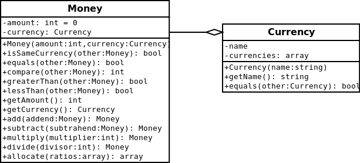

#Money
Represents a monetary value [More…](http://martinfowler.com/eaaCatalog/money.html)

```php
/** @var Money $money */
$money = Money::USD(200);
echo $money . PHP_EOL; //200 USD
echo $money->isSameCurrency($money) ? "true\n" : "false\n"; //true
echo $money->equals($money) ? "true\n" : "false\n"; //true
echo $money->compare(Money::USD(20)) . PHP_EOL; // 1
echo $money->greaterThan(Money::USD(9000)) ? "true\n" : "false\n"; //false
echo $money->lessThan(Money::USD(9000)) ? "true\n" : "false\n"; //true
echo $money->getAmount() , PHP_EOL; //200
echo $money->getCurrency() , PHP_EOL; //USD
echo $money->add(Money::USD(42)) , PHP_EOL; //242 USD
echo $money->subtract(Money::USD(42)) , PHP_EOL; //158 USD
echo $money->multiply(2) , PHP_EOL; //400 USD
echo $money->divide(2) , PHP_EOL; //100 USD
```

##Diagram


##Example and implementation
* [PHP implementation of Fowler's Money pattern](https://github.com/mathiasverraes/money) by [Mathias Verraes](https://github.com/mathiasverraes)