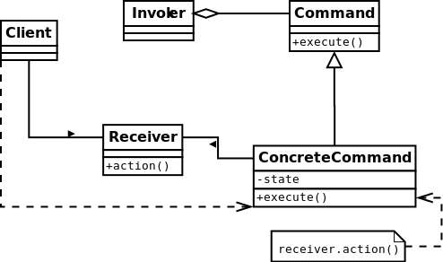

#Command
the command pattern is a behavioral design pattern in which an object is used to represent and encapsulate all
the information needed to call a method at a later time. This information includes the method name,
the object that owns the method and values for the method parameters.
[More…](http://en.wikipedia.org/wiki/Command_pattern)

```php
$user = new User();

echo $user->compute('+', 100); // result = 100 (after + with 100)
echo $user->compute('-', 50); // result = 50 (after - with 50)
echo $user->compute('*', 10); // result = 500 (after * with 10)
echo $user->compute('/', 2); // result = 250 (after / with 2)

$levels = 4;
echo "Repeat $levels operation\n";
echo $user->undo($levels); /*
Repeat 4 operation
result = 500 (after * with 2)
result = 50 (after / with 10)
result = 100 (after + with 50)
result = 0 (after - with 100)
*/

$levels = 3;
echo "Cancel $levels operation\n";
echo $user->redo($levels); /*
Cancel 3 operation
result = 100 (after + with 100)
result = 50 (after - with 50)
result = 500 (after * with 10)
*/
```

##Diagram


