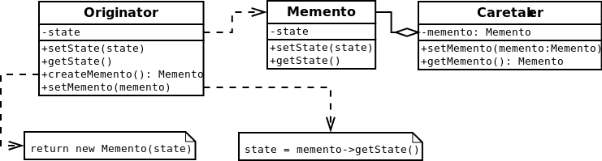

#Memento
Provides the ability to restore an object to its previous state (undo via rollback)
[More…](http://en.wikipedia.org/wiki/Memento_pattern)

```php
$originator = new Originator();
$originator->setState('on');
echo 'state: ' . $originator->getState() . PHP_EOL;
// state: on

// Store internal state
$caretaker = new Caretaker();
echo "save\n";
// save
$caretaker->setMemento($originator->createMemento());

// Continue changing originator
$originator->setState('off');
echo 'state: ' . $originator->getState() . PHP_EOL;
// state: off

// Restore saved state
echo "restore\n";
// restore
$originator->setMemento($caretaker->getMemento());

echo 'state: ' . $originator->getState() . PHP_EOL;
// state: on
```

##Diagram
