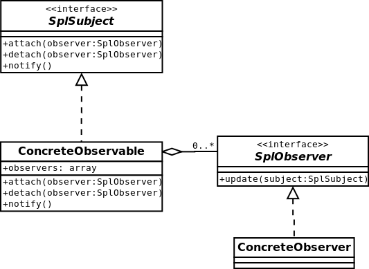

#Observer
The observer pattern is a software design pattern in which an object, called the subject, maintains a list of its dependents,
called observers, and notifies them automatically of any state changes, usually by calling one of their methods.
It is mainly used to implement distributed event handling systems.
[More…](http://en.wikipedia.org/wiki/Observer_pattern)

```php
$newspaper = new Newspaper('The New York Times');

$allen = new Reader('Allen');
$jim = new Reader('Jim');
$linda = new Reader('Linda');

$newspaper->attach($allen);
$newspaper->attach($jim);
$newspaper->attach($linda);

$newspaper->detach($linda);

$newspaper->breakOutNews('USA break down!'); /*
Allen is reading breakout news USA break down! (Newyork Times)
Jim is reading breakout news USA break down! (Newyork Times)
*/
```

##Diagram


##Linsk
* [The SplObserver interface](http://php.net/manual/en/class.splobserver.php)