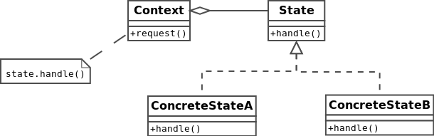

#State
This pattern is used in computer programming to encapsulate varying behavior for the same routine based on
an object's state object[More…](http://en.wikipedia.org/wiki/State_pattern)

##Diagram

##External links
* [Event-driven finite-state machine](http://en.wikipedia.org/wiki/Event-driven_finite-state_machine)