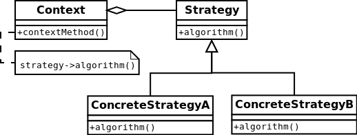

#Strategy
The strategy pattern (also known as the policy pattern) is a software design pattern
that enables an algorithm's behavior to be selected at runtime.

```php
$expression = new Expression(4, 2);
$expression->setStrategy(new Addition());
echo 'addition: ' . $expression->solve() . PHP_EOL;
// addition: 6
$expression->setStrategy(new Subtraction());
echo 'subtraction: ' . $expression->solve() . PHP_EOL;
// subtraction: 2
```

##Diagram
