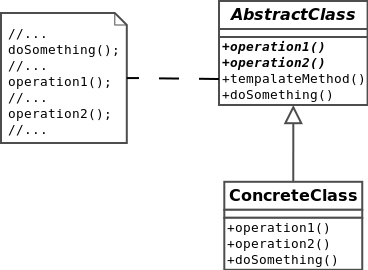

#Template method
Defines the program skeleton of an algorithm in a method, called template method, which defers some steps to subclasses.
[More…](http://en.wikipedia.org/wiki/Template_method_pattern)

```php
$concreteA = new ConcreteClassA();
var_dump($concreteA->run()); /* array(4) {
    'initialized' => string(61) "DesignPatterns\Structural\TemplateMethod\ConcreteClassA::init"
    'checked'     => string(62) "DesignPatterns\Structural\TemplateMethod\ConcreteClassA::check"
    'done'        => string(9) "something"
    'finally'     => string(60) "DesignPatterns\Structural\TemplateMethod\ConcreteClassA::end"
} */

$concreteB = new ConcreteClassB();
var_dump($concreteB->run()); /* array(4) {
    'initialized' => string(61) "DesignPatterns\Structural\TemplateMethod\ConcreteClassB::init"
    'checked'     => string(62) "DesignPatterns\Structural\TemplateMethod\ConcreteClassB::check"
    'done'        => string(9) "something"
    'finally'     => string(60) "DesignPatterns\Structural\TemplateMethod\ConcreteClassB::end"
} */
```

##Diagram
