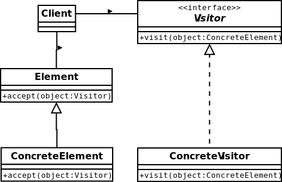

#Visitor
Is a way of separating an algorithm from an object structure on which it operates.
[More…](https://en.wikipedia.org/wiki/Visitor_pattern)

```php
$visitor = new RolePrintVisitor();

$user = new User('Dzyanis');
echo $user->accept($visitor) . PHP_EOL;
// Role: User: Dzyanis

$group = new Group('Programmer');
echo $group->accept($visitor) . PHP_EOL;
// Role: Group: Programmer
```

##Diagram
