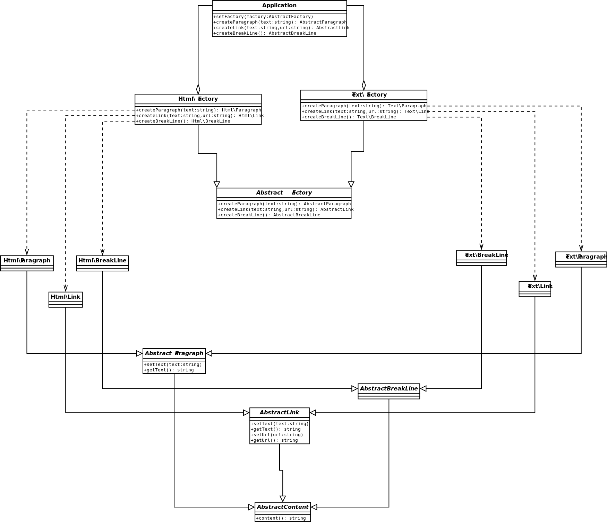

#Abstract Factory

The essence of the Abstract Factory Pattern is to "Provide an interface for creating families
of related or dependent objects without specifying their concrete classes.
[More…](http://en.wikipedia.org/wiki/Abstract_factory_pattern)

```php
$application = new Application();

function message(Application $application)
{
    $link = $application->createLink(
        'LinkedIn',
        'http://www.linkedin.com/pub/dzyanis-kuzmenka/30/4/862'
    );
    $paragraph = $application->createParagraph('My profile on ' . $link);
    return $paragraph . $application->createBreakLine();
}

$application->setFactory(new Html\Factory);
echo message($application);
// <p>My profile on <a href="http://www.linkedin.com/pub/dzyanis-kuzmenka/30/4/862">LinkedIn</a></p>
// <br />

$application->setFactory(new Text\Factory);
echo message($application);
// My profile on LinkedIn (http://www.linkedin.com/pub/dzyanis-kuzmenka/30/4/862)\n
```

##Diagram
