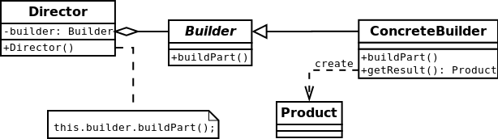

#Builder

The intent of the Builder design pattern is to separate the construction of a complex object from its representation.
By doing so, the same construction process can create different representations.
[More…](http://en.wikipedia.org/wiki/Builder_pattern)

'''php
$builder = new UserBuilder();
$builder->setFirstname('Dzyanis');
$builder->setLastname('Kuzmenka');
$builder->setLinkedinProfile('www.linkedin.com/pub/dzyanis-kuzmenka/30/4/862');
$builder->setFemale();

$userF = $builder->buildUser();
echo "Hello my name is {$userF->getFirstname()} {$userF->getLastname()} and I'm not {$userF->getGender()}, ";
// Hello my name is Dzyanis Kuzmenka and I'm not female,

$builder->setMale();
$userM = $builder->buildUser();

echo "because I'm {$userM->getGender()}.\n";
// because I'm male.

echo 'More information about me: ' . $userM->getLinkedinProfile() . PHP_EOL;
// More information about me: www.linkedin.com/pub/dzyanis-kuzmenka/30/4/862
'''

##Diagram
