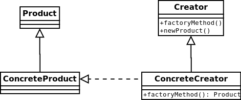

#Factory method

Factory method pattern is a creational pattern which uses factory methods to deal with the problem of creating objects
without specifying the exact class of object that will be created. This is done by creating objects via a factory method,
which is either specified in an interface (abstract class) and implemented in implementing classes (concrete classes);
or implemented in a base class (optionally as a template method), which can be overridden when inherited in derived classes;
rather than by a constructor.
[More…](http://en.wikipedia.org/wiki/Factory_method_pattern)

```php
$creators = [
    new ConcreteCreatorA(),
    new ConcreteCreatorB(),
];

foreach ($creators as $creator) {
    echo $creator->factoryMethod()->getName() . PHP_EOL;
} /*
Product A
Product B
*/
```

##Diagram
