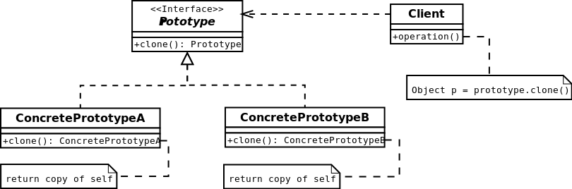

#Prototype
The prototype pattern is used when the type of objects to create is determined by a prototypical instance,
which is cloned to produce new objects.
[More…](http://en.wikipedia.org/wiki/Prototype_pattern)

```php
$userA = new User();
$userA->setName('Dzyanis');
$userA->setAge(27);
echo $userA->info() . PHP_EOL;
// Name Dzyanis, age 27

$userB = clone $userA;
echo $userB->info() . PHP_EOL;
// Name Dzyanis, age 27
```

##Diagram
