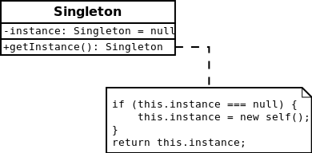

#Singleton

Singleton pattern is a design pattern that restricts the instantiation of a class to one object.
This is useful when exactly one object is needed to coordinate actions across the system.
The concept is sometimes generalized to systems that operate more efficiently when only one object exists,
or that restrict the instantiation to a certain number of objects.
The term comes from the mathematical concept of a singleton. [More…](http://en.wikipedia.org/wiki/Singleton_pattern)

```php
$objectA = Singleton::getInstance();
$objectA->setValue(1);

$objectB = Singleton::getInstance();
$objectB->setValue(2);

echo 'Equal : ' . ($objectA->getValue() == $objectB->getValue()) ? 'yes' : 'no';
echo PHP_EOL; // yes

// Fatal error: Call to private method
// $objectC = new Singleton();
```

##Diagram
