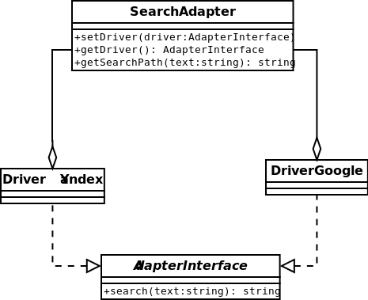

#Adapter

An adapter helps two incompatible interfaces to work together.
This is the real world definition for an adapter.
The adapter design pattern is used when you want two different classes with incompatible interfaces to work together.
Interfaces may be incompatible but the inner functionality should suit the need.
The Adapter pattern allows otherwise incompatible classes to work together by converting
the interface of one class into an interface expected by the clients.
[More…](http://en.wikipedia.org/wiki/Adapter_pattern)

```php
$searchYandex = new SearchAdapter(SearchAdapter::YANDEX);
$searchGoogle = new SearchAdapter(SearchAdapter::GOOGLE);

echo $searchYandex->getSearchPath('dzyanis') . PHP_EOL;
//http://yandex.by/yandsearch?text=dzyanis

echo $searchGoogle->getSearchPath('dzyanis') . PHP_EOL;
//http://www.google.by/search?q=dzyanis
```
(not best example because both object have one interface)


##Diagram


##Example
* [DB Component from ZF2](https://github.com/zendframework/zf2/tree/master/library/Zend/Db)
* [HTTP Component from ZF2](https://github.com/zendframework/zf2/tree/master/library/Zend/Http)