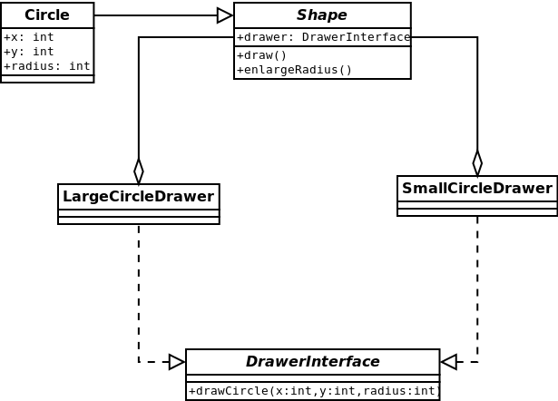

#Bridge
Decouple an abstraction from its implementation so that the two can vary independently.
[More…](http://en.wikipedia.org/wiki/Bridge_pattern)

```php
$circle = new Circle(5, 10, 10, new LargeCircleDrawer());
$circle->draw(); // Large circle center = ( 5, 10 ) radius = 100
$circle = new Circle(20, 30, 100, new SmallCircleDrawer());
$circle->draw(); // Small circle center = ( 20, 30 ) radius = 25
```

##Diagram
