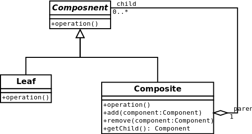

#Composite
The composite pattern describes that a group of objects is to be treated in the same way as a single instance of an object.
The intent of a composite is to "compose" objects into tree structures to represent part-whole hierarchies.
Implementing the composite pattern lets clients treat individual objects and compositions uniformly.
[More…](http://en.wikipedia.org/wiki/Composite_pattern)

```php
$root = new Composite('root');

$root->add(new Leaf('Leaf A'));
$root->add(new Leaf('Leaf B'));

$comp = new Composite('Composite X');

$comp->add(new Leaf('Leaf XA'));
$comp->add(new Leaf('Leaf XB'));
$root->add($comp);
$root->add(new Leaf('Leaf C'));

// Add and remove a leaf
$leaf = new Leaf('Leaf D');
$root->add($leaf);
$root->remove($leaf);

// Recursively display tree
$root->display(); /*
Leaf A
Leaf B
Leaf XA
Leaf XB
Leaf C
*/
```

##Diagram
