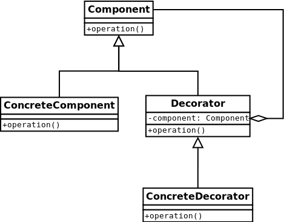

#Decorator
Allows behavior to be added to an individual object, either statically or dynamically,
without affecting the behavior of other objects from the same class.
[More…](http://en.wikipedia.org/wiki/Decorator_pattern)

```php
$figures = new Bar(
    new Circle(
        new Bar(
            new Circle(
                new Void()
            )
        )
    )
);
echo $figures->getInfo() . PHP_EOL;
// Bar Circle Bar Circle
```

##Diagram


##Examples
* [Form Component from ZF1](https://github.com/zendframework/zf1/blob/master/library/Zend/Form.php#L68)