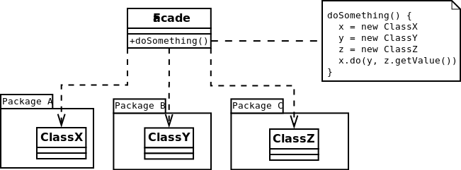

#Facade
Provides a simplified interface
[More…](https://en.wikipedia.org/wiki/Facade_pattern)

```php
$computer = new ComputerFacade();
$computer->start(); /*
DesignPatterns\Structural\Facade\Cpu::freeze
DesignPatterns\Structural\Facade\Memory::load 42 Some data from your hard disk
DesignPatterns\Structural\Facade\Cpu::jump 42
DesignPatterns\Structural\Facade\Cpu::execute
*/
```

##Diagram


##Links
* [Manage Complexity with the Facade Pattern](http://www.sitepoint.com/manage-complexity-with-the-facade-pattern/)