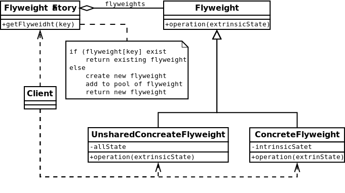

#Flyweight
A flyweight is an object that minimizes memory use by sharing as much data as possible with other similar objects;
it is a way to use objects in large numbers when a simple repeated representation would use an unacceptable
amount of memory. Often some parts of the object state can be shared, and it is common practice to hold them in
external data structures and pass them to the flyweight objects temporarily when they are used.
[More…](http://en.wikipedia.org/wiki/Flyweight_pattern)

```php
$factory = new ElementFactory();
echo $factory->getElement('H')->info() . PHP_EOL;
// Name 'Hydrogen', atomic number 1
echo $factory->getElement('He')->info() . PHP_EOL;
// Name 'Helium', atomic number 2
echo $factory->getElement('Li')->info() . PHP_EOL;
// Name 'Lithium', atomic number 3
echo $factory->getElement('Uuo')->info() . PHP_EOL;
// Name 'Ununoctium', atomic number 118
```

##Diagram
