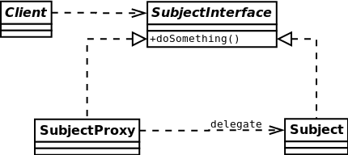

#Proxy
A proxy, in its most general form, is a class functioning as an interface to something else. The proxy could interface
to anything: a network connection, a large object in memory, a file,
or some other resource that is expensive or impossible to duplicate.
[More…](http://en.wikipedia.org/wiki/Proxy_pattern)

```php
$math = new Math(); // INIT VERY FAT OBJECT
echo 'add 2 2 : ' . $math->add(2, 2) . PHP_EOL; // add 2 2 : 4
echo 'div 2 2 : ' . $math->div(2, 2) . PHP_EOL; // div 2 2 : 1
echo 'sub 2 2 : ' . $math->sub(2, 2) . PHP_EOL; // sub 2 2 : 0
echo 'mul 2 2 : ' . $math->mul(2, 2) . PHP_EOL; // mul 2 2 : 4

$math = new MathProxy();
echo "Proxy:\n"; // Proxy:
echo 'add 2 2 : ' . $math->add(2, 2) . PHP_EOL; // add 2 2 : 4
echo 'sub 2 2 : ' . $math->sub(2, 2) . PHP_EOL; // sub 2 2 : 0
// INIT VERY FAT OBJECT
echo 'div 2 2 : ' . $math->div(2, 2) . PHP_EOL; // div 2 2 : 4
echo 'mul 2 2 : ' . $math->mul(2, 2) . PHP_EOL; // mul 2 2 : 4
```

##Diagram
