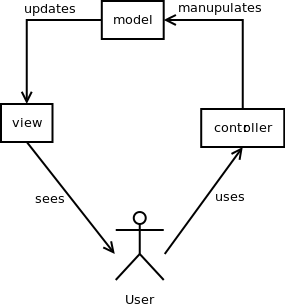

#Model View Controller
It divides a given software application into three interconnected parts,
so as to separate internal representations of information from the ways that information is presented to or accepted
from the user
[More…](http://en.wikipedia.org/wiki/Model%E2%80%93view%E2%80%93controller)

```php
$controller = new Controller();
echo $controller->actionXml() . PHP_EOL; /*
<document>
    <type>xml</type>
    <user_id>1</user_id>
    <user_name>Dzyanis Kuzmenka</user_name>
 </document> */

echo $controller->actionText() . PHP_EOL; /*
This is {$this->data->type}
User id {$this->data->user_id}
User name {$this->data->user_name} */

echo $controller->actionJson() . PHP_EOL; /*
{
    "type":"xml",
    "user_id":1,
    "user_name":"Dzyanis Kuzmenka"
 } */
```

##Diagram


##Links
* [Introduction to the MVC Layer in Zend Framework 2](http://framework.zend.com/manual/2.0/en/modules/zend.mvc.intro.html)